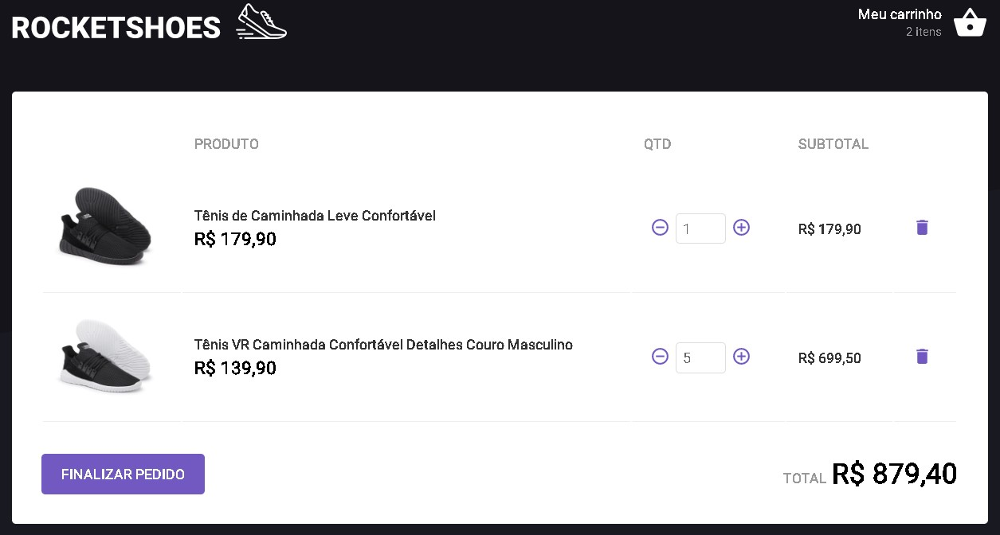

<p align="center">
  
</p>
<p align="center">🚀 E-commerce made with react, redux and redux-saga</p>
<p align="center">
  
  
  
  
</p>

<div align="center">
 <a href="#-objective">objective</a> •
 <a href="#-roadmap">roadmap</a> • 
 <a href="#-technologies">technologies</a> • 
 <a href="#-author">author</a>
</div>

---
</br>
<p align="center" >
  
  
</p>

## 💡 Objective
<p>The main purpose of this app was to train my redux and redux-saga concepts with react.
Basically, the app is a shoe e-commerce, which works with state sharing between the catalog component and the shopping cart component.</p>

## 🎌 Roadmap

### Prerequisites
Before starting, you will need to have the following tools installed on your machine:
<ul>
  <li><a href="https://git-scm.com">Git</a></li>
  <li><a href="https://nodejs.org/en/">Node</a></li>
  <li><a href="https://yarnpkg.com/getting-started/install">Yarn</a></li>
</ul>

You can also use npm, but we seriously recommend yarn.

Also it's nice to have an editor to work with the code like [VSCode](https://code.visualstudio.com/).

### Running the Server

**Execute the commands**

```bash
# Clone this repository
$ git clone https://github.com/mathmelo/rocketshoes-redux-codebase

# Access the project folder in the terminal/cmd
$cd rocketshoes-redux-codebase

# Install dependencies
$ yarn

# The application must run on two nodes. If you are using VsCode, just open a terminal for each of these commands
# Run server
$ yarn server

# Run the application in development mode
$ yarn start

# The server will start on port:3000 - go to <http://localhost:3000>
```

## 💜 Technologies
- Javascript
- ReactJS
- Redux
- Redux Saga

## 🤓 Author

Informations about [me](https://github.com/mathmelo).
Send me a message! ;)

<h4 align="center"> 
	🚧  Rocketshoes 🚀 Only for study...  🚧</br>
</h4>
